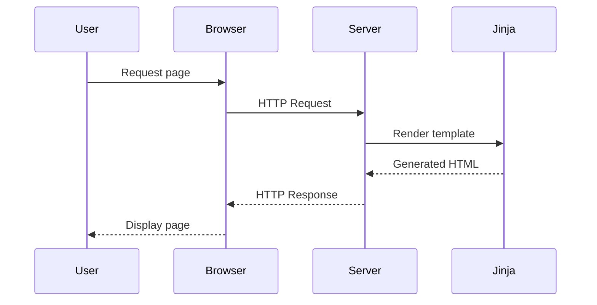
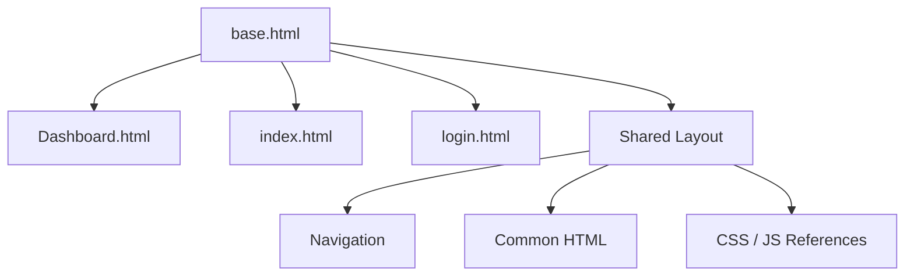

# CustomCMS

> A modular web-based Content Management System built with Python, HTML, CSS, JavaScript, and Jinja templates.

---

## Overview

CustomCMS is a lightweight CMS designed with a clear separation between application logic, templates, static assets, and configuration.

The project is structured to support maintainability, scalability, and future feature expansion.

---

## Architecture

```mermaid
flowchart TD
    A[Client / Browser] --> B[main.py]
    B --> C[Jinja Templates]

    C --> D[base.html]
    C --> E[index.html]
    C --> F[Dashboard.html]
    C --> G[login.html]

    D --> H[Static Assets]

    H --> I[CSS]
    H --> J[JavaScript]

    I --> K[style.css]
    J --> L[script.js]
````

---

## Project Structure

```text
Clg-dashboard/
│
├── CustomCMS/
│   │
│   ├── static/
│   │   ├── CSS/
│   │   │   └── style.css
│   │   │
│   │   └── scripts/
│   │       └── script.js
│   │
│   ├── templates/
│   │   ├── base.html
│   │   ├── Dashboard.html
│   │   ├── index.html
│   │   └── login.html
│   │
│   ├── main.py
│   ├── requirements.txt
│   └── README.md
│
└── .gitignore
```

---

## Tech Stack

| Technology | Purpose                     |
| ---------- | --------------------------- |
| Python     | Backend application logic   |
| Jinja      | Server-side HTML templating |
| HTML5      | Page structure              |
| CSS3       | Styling                     |
| JavaScript | Client-side functionality   |

---

## Application Flow



---

## Installation

### 1. Clone the repository

```bash
git clone <repository-url>
cd Clg-dashboard
```

### 2. Create a virtual environment

```bash
python3 -m venv .myvenv
```

### 3. Activate the environment

**Windows:**

```powershell
venv\Scripts\activate
```

**Linux / macOS:**

```bash
source venv/bin/activate
```

### 4. Install dependencies

```bash
pip install -r requirements.txt
```

---

## Running the Application

```bash
uvicorn main:app --reload
```

Then open the application in your browser using the local server address provided by the application.

---

## Template Architecture

The project uses Jinja template inheritance to avoid duplicating common HTML structure.



This allows shared components to be maintained in a single template while individual pages extend the base layout.

---

## Development

The project follows a separation-of-concerns approach:

```text
Backend
   │
   └── main.py

Presentation
   │
   └── templates/
       └── Jinja HTML templates

Static Assets
   │
   └── static/
       ├── CSS/
       └── scripts/
```

Changes should be developed in separate Git branches and merged into the main development branch after testing.

---

## Contributing

1. Create a feature branch.
2. Make the required changes.
3. Test the application locally.
4. Commit the changes with a meaningful message.
5. Push the branch.
6. Open a pull request.

---

## License

This project is currently intended for educational and development purposes.

